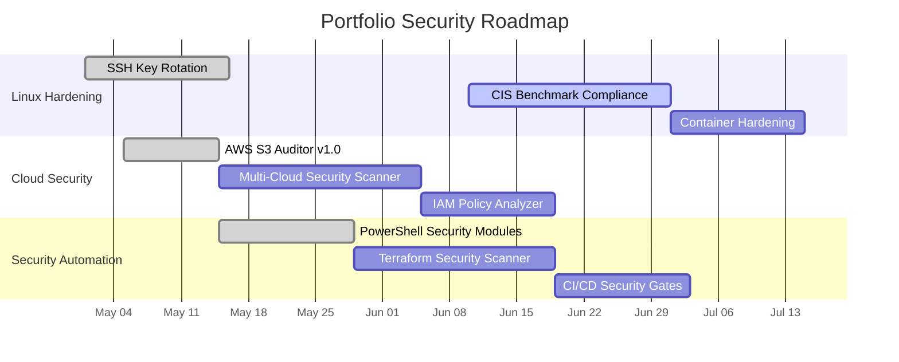
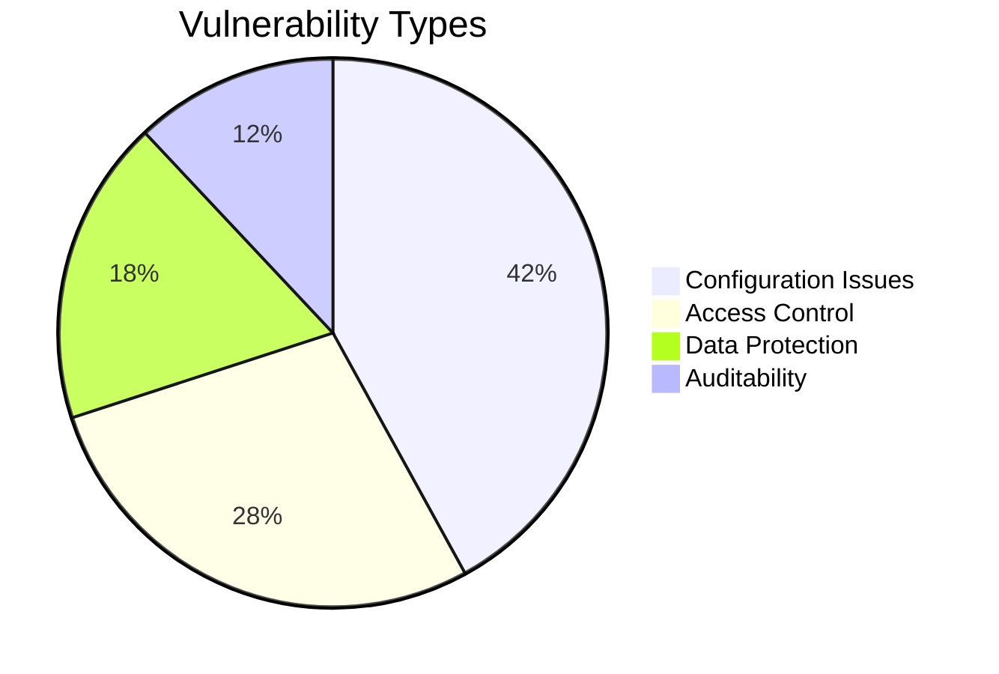

# 🛡️ Security Enhancement Roadmap

## 🎯 Current Priorities

| Priority | Project | Task | Status | Owner |
|----------|---------|------|--------|-------|
| 🔴 High | Linux Hardening | Implement CIS Level 1 Benchmark | In Progress | @enzolucchesi |
| 🟠 Medium | Cloud Security | Expand AWS scanner to cover IAM policies | Planned | @enzolucchesi |
| 🟢 Low | Security Automation | Integrate SAST into CI/CD pipeline | Backlog | @enzolucchesi |

## ✅ Completed Tasks
- [x] Implement SSH key rotation automation
- [x] Create AWS S3 security auditor
- [x] Develop PowerShell security auditing modules

## 📊 Security Metrics

## 📅 Next Review Date: 2025-07-01
