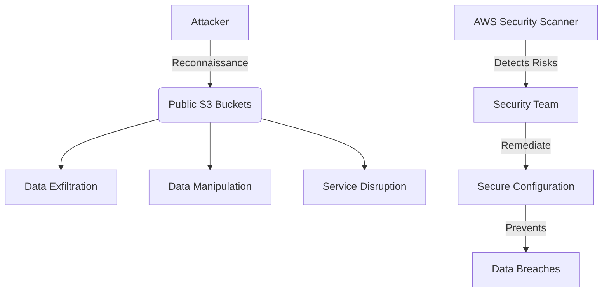

# AWS Security Scanner

  

A Python tool for detecting common security misconfigurations in AWS S3 buckets. Identifies publicly accessible buckets, missing encryption, and other security vulnerabilities with detailed remediation recommendations.

## 🔒 Security Impact

This project demonstrates critical cloud security principles:
- **Asset Discovery**: Automated identification of S3 bucket misconfigurations
- **Risk Assessment**: Systematic evaluation of security posture across AWS resources
- **Compliance Monitoring**: Alignment with AWS security best practices and frameworks
- **Proactive Security**: Early detection before exploitation by threat actors

### Threat Model


## ☁️ Cloud Security Relevance

1. **S3 Security**: Directly addresses AWS S3 bucket misconfigurations - a leading cause of data breaches
2. **Compliance**: Supports CIS AWS Foundations Benchmark and SOC 2 requirements
3. **Cost Control**: Prevents costly security incidents from misconfigured cloud storage
4. **DevSecOps Integration**: Enables automated security checks in CI/CD pipelines

## Features

- Detects publicly accessible S3 buckets
- Checks if S3 bucket encryption is enabled
- Verifies if S3 bucket access logging is configured
- Checks for S3 bucket versioning status
- Checks for S3 MFA Delete status
- Checks for secure bucket policies (basic check)
- Generates a simple report with findings and remediation steps

## Requirements

- Python 3.7+
- AWS account with programmatic access (credentials configured via AWS CLI, environment variables, or IAM roles)
- Boto3, Colorama, and Tabulate Python libraries (see `requirements.txt`)

### Required IAM Permissions
To run this scanner effectively, the AWS IAM user or role executing the script needs the following minimum S3 permissions:

- `s3:ListAllMyBuckets`
- `s3:GetBucketLocation`
- `s3:GetBucketPublicAccessBlock`
- `s3:GetBucketAcl`
- `s3:GetBucketPolicy`
- `s3:GetEncryptionConfiguration`
- `s3:GetBucketLogging`
- `s3:GetBucketVersioning`

It's recommended to follow the principle of least privilege when configuring credentials.

## Setup

1. Clone this repository
2. Set up your AWS credentials (using `aws configure` or environment variables)
3. Install required packages:
   ```
   pip install -r requirements.txt
   ```

## Usage

```bash
# Scan all S3 buckets in your account
python s3_scanner.py

# Generate a detailed report
python s3_scanner.py --report detailed

# Scan specific buckets
python s3_scanner.py --buckets bucket1,bucket2

# Save detailed report to a file
python s3_scanner.py --report detailed --output detailed_report.txt
```

## Understanding the Output

The script provides a console report summarizing the security status of each scanned S3 bucket.

### Console Report Symbols:
-   **✓** (Green Checkmark): Indicates a secure configuration or that a recommended feature is enabled.
-   **✗** (Red X): Indicates an insecure configuration or that a recommended feature is not enabled.
-   **?** (Yellow Question Mark): Indicates that the status could not be determined (e.g., due to an API error, insufficient permissions for that specific check, or the feature is not applicable). Warnings will be printed to the console for such cases.

The "Overall" column gives a quick summary: "Secure" if all checks pass, "Insecure" otherwise.

For a detailed breakdown of issues and recommendations (if you use the `--report detailed` flag), and an example of the text file output, please see the `examples/sample_report.txt` file in this repository.

## Security Best Practices Demonstrated

This script helps identify these common AWS misconfigurations:

1. **Public S3 Buckets**: S3 buckets should not be publicly accessible unless absolutely necessary.
2. **Missing Encryption**: S3 buckets should use server-side encryption at rest to protect sensitive data.
3. **Access Logging**: Critical buckets should have access logging enabled to track requests and identify potential security incidents.
4. **Bucket Versioning**: Enabling versioning helps protect against accidental data deletion or overwrites.
5. **MFA Delete**: For versioned buckets, MFA Delete adds an extra layer of security by requiring multi-factor authentication for permanently deleting object versions.
6. **Insecure Bucket Policies**: Bucket policies should follow the principle of least privilege and avoid overly permissive configurations.

## Project Structure

```
aws-security-scanner/
├── s3_scanner.py         # Main scanner script
├── requirements.txt      # Project dependencies
├── README.md             # Project documentation
└── examples/             # Example output reports
```

## Limitations

This is a basic scanner for educational purposes. For production environments, consider more comprehensive tools like AWS Config, Security Hub, or commercial security posture management solutions.

## Next Steps

Future enhancements could include:
- Scanning additional AWS resources (EC2, RDS, IAM, etc.)
- More sophisticated bucket policy analysis
- Integration with AWS Security Hub
- CloudFormation template scanning
- Automated remediation suggestions
