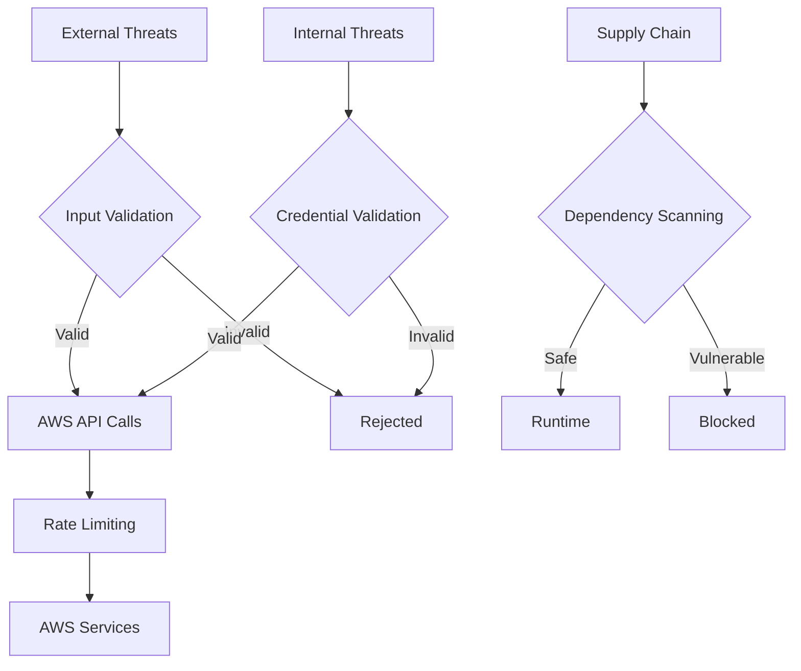

# Security Policy

## Supported Versions

We actively support the following versions of AWS Security Suite with security updates:

| Version | Supported          |
| ------- | ------------------ |
| 0.1.x   | :white_check_mark: |

## Security Features

### Built-in Security Controls

- **Input Validation**: All user inputs are validated against allowlists and regex patterns
- **Credential Protection**: No hardcoded credentials, environment variable sanitization
- **Error Handling**: Sanitized error messages to prevent information disclosure
- **Dependencies**: Regular updates and vulnerability scanning
- **Path Validation**: Protection against path traversal attacks
- **Rate Limiting**: Built-in protection against API abuse

### Security Scanning

We use multiple layers of security scanning:

- **Static Analysis**: Bandit, Semgrep, CodeQL
- **Dependency Scanning**: Safety, pip-audit
- **Secret Detection**: TruffleHog
- **Container Security**: Trivy (when applicable)
- **License Compliance**: pip-licenses

## Reporting a Vulnerability

We take security seriously and appreciate responsible disclosure of security vulnerabilities.

### How to Report

1. **DO NOT** create a public GitHub issue for security vulnerabilities
2. Email security details to: `security@example.com`
3. Include the following information:
   - Description of the vulnerability
   - Steps to reproduce
   - Potential impact
   - Suggested fix (if any)

### What to Expect

- **Acknowledgment**: Within 24 hours
- **Initial Assessment**: Within 72 hours
- **Status Updates**: Weekly until resolved
- **Resolution Timeline**: 30-90 days depending on severity

### Severity Levels

| Severity | Description | Response Time |
|----------|-------------|---------------|
| Critical | Remote code execution, data exposure | 24 hours |
| High | Privilege escalation, authentication bypass | 72 hours |
| Medium | DoS, information disclosure | 1 week |
| Low | Minor issues with minimal impact | 2 weeks |

## Security Best Practices for Users

### Credentials Management

- **Never** hardcode AWS credentials in code
- Use IAM roles when possible
- Rotate access keys regularly (every 90 days)
- Follow principle of least privilege

### Deployment Security

- Use dedicated AWS profiles for scanning
- Limit scanner permissions to read-only where possible
- Monitor CloudTrail logs for scanner activity
- Consider running in isolated VPC/subnet

### Network Security

- Run scans from trusted networks
- Use VPC endpoints when available
- Monitor for unusual API activity
- Implement IP allowlisting for sensitive environments

## Security Architecture

### Threat Model



### Security Controls

1. **Input Sanitization**
   - Service names validated against allowlist
   - Region names validated with regex
   - ARN format validation
   - Path traversal prevention

2. **Authentication & Authorization**
   - AWS credential validation
   - Role assumption with external ID
   - Cross-account access controls
   - Session management

3. **Data Protection**
   - No sensitive data logging
   - Encrypted communication (HTTPS)
   - Secure error handling
   - Memory protection

4. **Monitoring & Logging**
   - Audit trail support
   - Rate limiting visibility
   - Error tracking
   - Performance monitoring

## Compliance

### Standards Alignment

- **OWASP Top 10**: Protection against common web application vulnerabilities
- **CIS Benchmarks**: Following CIS security best practices
- **NIST Cybersecurity Framework**: Aligned with Identify, Protect, Detect, Respond, Recover
- **SOC 2**: Security, availability, and confidentiality controls

### Regular Security Activities

- **Monthly**: Dependency vulnerability scans
- **Quarterly**: Penetration testing (internal)
- **Annually**: Security architecture review
- **Continuous**: Automated security scanning in CI/CD

## Security Testing

### Automated Testing

Our CI/CD pipeline includes:

```bash
# Run security test suite
./security-check.sh

# Individual tools
bandit -r . --config .bandit
safety check --json
semgrep --config=auto .
```

### Manual Testing

Before releases, we perform:
- Manual code review for security issues
- Dependency audit
- Configuration review
- Integration testing with security focus

## Contact Information

- **Security Team**: security@example.com
- **General Contact**: support@example.com
- **Documentation**: https://aws-security-suite.readthedocs.io

## Acknowledgments

We appreciate the security research community and will acknowledge contributors who report valid security issues (with permission).

---

*This security policy is reviewed and updated quarterly. Last updated: 2024-01-01*