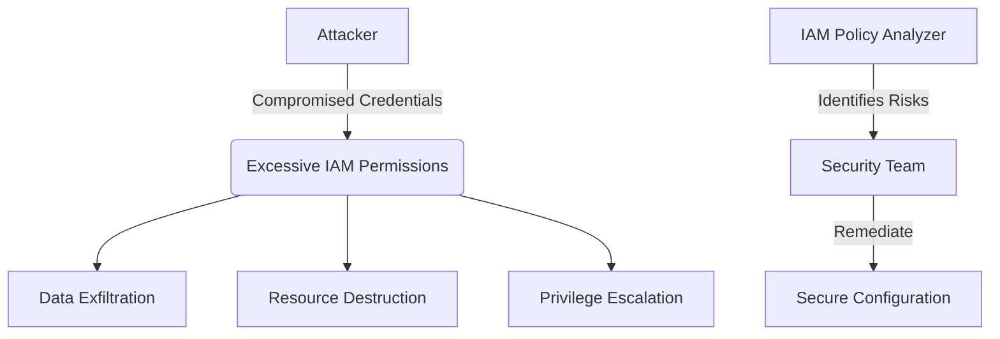

# AWS IAM Policy Analyzer

 

A security tool to identify excessive permissions in AWS IAM policies. Analyzes IAM policies for common security risks like wildcard permissions and sensitive actions.

## 🔒 Security Impact

This project demonstrates critical cloud security principles:
- **Principle of Least Privilege**: Identifies overly permissive IAM policies
- **Access Control Validation**: Detects wildcard permissions (*) in actions and resources
- **Sensitive Operation Monitoring**: Flags high-risk actions (Delete, Put, Update)
- **Security Automation**: Provides automated policy analysis

### Threat Model


## ☁️ Cloud Security Relevance

1. **IAM Security**: Directly addresses AWS Identity and Access Management risks
2. **Compliance**: Helps meet CIS AWS Foundations Benchmark requirements
3. **Risk Reduction**: Proactively identifies misconfigurations before exploitation
4. **Cost Control**: Prevents costly security incidents from excessive permissions

## Usage

### Prerequisites
- AWS credentials with IAM read access
- Python 3.11+
- Required packages: `boto3`, `colorama`

### Installation
```bash
pip install -r requirements.txt
```

### Running the Analyzer
```bash
./iam_analyzer.py --policy-arn arn:aws:iam::123456789012:policy/MyPolicy
```

### Output Formats
- Text (default): Color-coded risk assessment
- JSON: Machine-readable output for integration

```bash
# JSON output example
./iam_analyzer.py --policy-arn arn:aws:iam::123456789012:policy/MyPolicy --output json
```

## 🔍 Example Findings


## Defensive Security Annotations
```python
# DEFENSIVE PRACTICE: Validate policy document structure
if 'Statement' not in document:
    return [{'risk': 'CRITICAL', 'description': 'Policy missing Statement element'}]
```

```python
# DEFENSIVE PRACTICE: Check for wildcard permissions
if '*' in actions:
    findings.append({
        'risk': 'HIGH',
        'description': 'Wildcard action permission',
        'statement': statement
    })
```

## 📈 Future Enhancements
- Multi-account scanning
- Integration with AWS Organizations
- Automated remediation suggestions
- Historical policy version comparison

## License
MIT License - See [LICENSE](../LICENSE) for details
