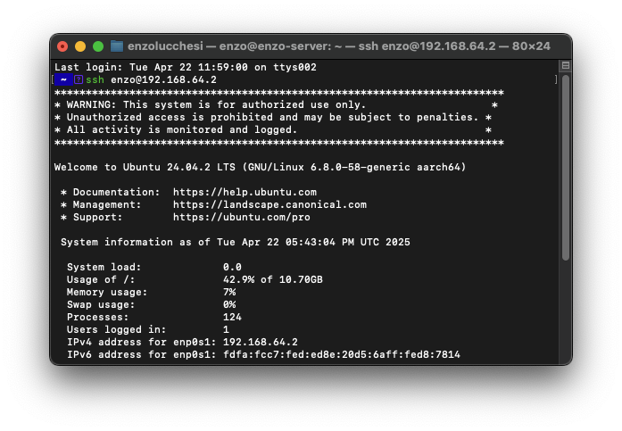
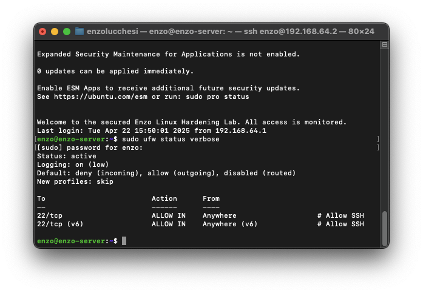
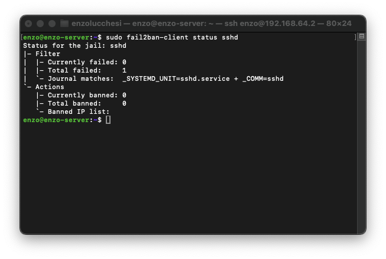
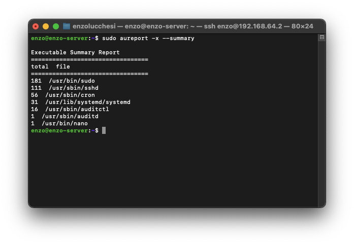

# Linux Server Hardening Scripts

## Overview
This project provides a collection of scripts to help automate the hardening of a Linux server (tested on Ubuntu 22.04 ARM). It implements common security best practices, including locking down remote access, enforcing password policies, setting up basic intrusion detection, configuring audit logging, and applying secure kernel parameters.

The original lab involved manually hardening a VM on a MacBook using UTM. These scripts aim to automate many of those steps.

---

## Hardening Areas Covered (Manual & Automated)
The project addresses the following hardening areas, now largely automated by the provided scripts:

-   **SSH Key-Only Login & Secure Configuration:** Disables password/root login, sets secure defaults.
-   **Firewall (UFW):** Installs UFW (firewall configuration within scripts is minimal - requires manual setup or enhancement).
-   **Intrusion Prevention (Fail2ban):** Installs and enables the SSH jail.
-   **Automatic Security Updates:** Installs `unattended-upgrades`.
-   **Password Policy Enforcement:** Checks system-wide policy (script does not currently *set* `pam_pwquality` rules).
-   **Audit Logging (`auditd`):** Installs `auditd` and applies a baseline ruleset.
-   **Legal Warning Banner:** Sets a standard warning banner in `/etc/issue.net`.
-   **Kernel Parameters (`sysctl`):** Applies security-focused network, memory, and filesystem settings.

---

## Automated Hardening Scripts

This repository now includes scripts to automate the installation, configuration, and checking of hardening measures.

**Structure:**

*   `apply-all.sh`: Master script to run all installation and configuration steps. **Run this first.**
*   `check-hardening.sh`: Checks the system against the applied hardening settings and provides a score. **Run this after `apply-all.sh`.**
*   `install-packages.sh`: Installs required packages (`ufw`, `fail2ban`, `auditd`, `unattended-upgrades`).
*   `ssh-config/`: Contains `apply-ssh-config.sh` to harden `/etc/ssh/sshd_config`.
*   `fail2ban/`: Contains `apply-fail2ban-config.sh` to setup `/etc/fail2ban/jail.local` and enable the SSH jail.
*   `auditd-rules/`: Contains `apply-auditd-rules.sh` to apply baseline rules to `/etc/audit/rules.d/`.
*   `banner/`: Contains `apply-banner.sh` to set `/etc/issue.net`.
*   `sysctl/`: Contains `apply-sysctl-config.sh` to apply settings via `/etc/sysctl.d/`.

**Usage:**

1.  **Clone the Repository:**
    ```bash
    git clone https://github.com/lucchesi-sec/cybersec-projects.git # Or your fork/clone URL
    cd cybersec-projects/linux-server-hardening
    ```
2.  **Review Scripts:** **Carefully review `apply-all.sh` and the scripts it calls** to understand the changes they will make to your system. Pay special attention to `ssh-config/apply-ssh-config.sh` if you rely on password authentication.
3.  **Ensure Key-Based SSH:** If you intend to use these scripts on a remote server, ensure you have **working SSH key-based authentication** set up *before* running the scripts, as password authentication will be disabled.
4.  **Run the Applicator Script:**
    ```bash
    chmod +x apply-all.sh
    sudo ./apply-all.sh
    ```
    Monitor the output for errors.
5.  **Run the Check Script:**
    ```bash
    chmod +x check-hardening.sh
    sudo ./check-hardening.sh
    ```
    Review the pass/fail results and the overall score.
6.  **Reboot (Recommended):**
    ```bash
    sudo reboot
    ```
    Run the check script again after reboot to ensure settings persisted.

**Prerequisites:**

*   A Debian/Ubuntu-based system (uses `apt`, `ufw`, `systemctl`).
*   `sudo` privileges.
*   `git` (to clone the repository).

**Warning:** These scripts modify critical system configurations. **Use them at your own risk.** Always back up important data before applying significant system changes. Testing in a non-production environment (like a VM) first is highly recommended.

---

## 📸 Screenshots

### SSH Login with Legal Warning Banner


---

### UFW Firewall Status


---

### Fail2ban SSH Protection Status


---

### Auditd Executable Summary Report


---

## Tools and Technologies Used
- Ubuntu 22.04 LTS (ARM) - *Testing environment*
- UTM (virtualization on MacBook) - *Testing environment*
- Bash Scripting
- OpenSSH
- UFW Firewall
- Fail2ban
- Auditd / Ausearch / Aureport / Auditctl
- `sysctl`
- PAM (`pam_pwquality.so`) for password complexity enforcement (*Note: Checked but not configured by scripts*)
- Unattended Upgrades (APT)
- Git

---

## ELK Stack Integration (Optional)

For centralized logging and analysis of the data generated by the hardened server (e.g., `auditd`, `fail2ban`, `syslog`), consider integrating with an ELK (Elasticsearch, Logstash, Kibana) stack.

Basic installation scripts and integration guidance can be found in the [`elk-stack/`](./elk-stack/) directory and the accompanying [`elk-integration.md`](./elk-stack/elk-integration.md) document.

---

## Lessons Learned
- How to properly secure SSH access and avoid common misconfigurations.
- The importance of layering defensive controls (firewall + Fail2ban + key-based auth).
- How auditd works for tracking critical system events.
- Reinforced understanding of basic Linux administration and compliance-focused hardening techniques.
- The value of centralized logging (e.g., using ELK) for aggregating and analyzing security-relevant events (like auditd logs, firewall blocks, failed logins) from a hardened system.
- **The process of automating hardening steps using shell scripting.**

---

## Notes
This project provides scripts to apply foundational Linux security hardening steps. The setup provides a good baseline, but additional layers like AppArmor/SELinux, more comprehensive audit rules, IDS/IPS tools, specific file permission hardening, and centralized logging would be necessary next steps for a production or compliance-driven environment (e.g., DoD STIGs).
