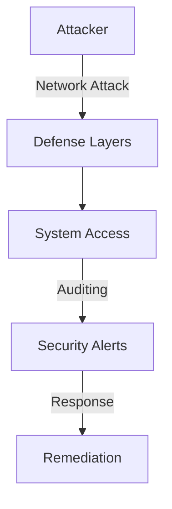
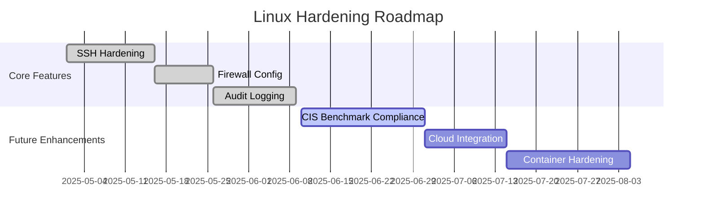

# Linux Server Hardening Scripts

## Overview
This project provides a collection of scripts to help automate the hardening of a Linux server (tested on Ubuntu 22.04 ARM). It implements common security best practices, including locking down remote access, enforcing password policies, setting up basic intrusion detection, configuring audit logging, and applying secure kernel parameters.

The original lab involved manually hardening a VM on a MacBook using UTM. These scripts aim to automate many of those steps and serve as a practical learning exercise in Linux system administration and security.

## 🔒 Security Impact

This project demonstrates key defensive security principles through layered security controls:

- **Defense in Depth**: Multiple security layers (firewall, IDS, authentication controls)
- **Least Privilege**: SSH key-only access, restricted root login
- **Automated Compliance**: Scripted enforcement of security configurations
- **Auditability**: Comprehensive logging with auditd
- **Maintainability**: Automated security updates and configuration management

### Threat Model



## ☁️ Cloud Security Relevance

While focused on on-prem servers, these hardening principles directly apply to cloud environments:

1. **Cloud Instance Hardening**: Same security controls protect cloud VMs
2. **Compliance Frameworks**: Meets requirements for CIS, NIST, ISO 27001
3. **Infrastructure as Code**: Scripts can be integrated into cloud init scripts
4. **Defense in Depth**: Layered approach aligns with cloud security best practices

## Project Roadmap



---

## Hardening Areas Covered (Manual & Automated)
The project addresses the following hardening areas, now largely automated by the provided scripts:

-   **SSH Key-Only Login & Secure Configuration:** Disables password/root login, sets secure defaults.
-   **Firewall (UFW):** Installs UFW, sets default deny incoming/allow outgoing policies, allows SSH (OpenSSH & port 22/tcp), and enables the firewall.
-   **Intrusion Prevention (Fail2ban):** Installs and enables the SSH jail.
-   **Automatic Security Updates:** Installs `unattended-upgrades` and configures it to automatically apply security updates, including automatic reboots if required by an update.
-   **Password Policy Enforcement:** Installs `libpam-pwquality` and configures password complexity rules in `/etc/pam.d/common-password` and password aging policies in `/etc/login.defs`.
-   **Audit Logging (`auditd`):** Installs `auditd` and applies a baseline ruleset.
-   **Legal Warning Banner:** Sets a standard warning banner in `/etc/issue.net`.
-   **Kernel Parameters (`sysctl`):** Applies security-focused network, memory, and filesystem settings.

---

## Automated Hardening Scripts

This repository now includes scripts to automate the installation, configuration, and checking of hardening measures.

**Structure:**

*   `apply-all.sh`: Master script to run all installation and configuration steps. **Run this first.**
*   `check-hardening.sh`: Checks the system against the applied hardening settings and provides a score. **Run this after `apply-all.sh`.**
*   `install-packages.sh`: Installs required packages (`ufw`, `fail2ban`, `auditd`, `unattended-upgrades`, `libpam-pwquality`).
*   `password-policy/`: Contains `apply-pam-pwquality.sh` to configure password complexity and aging.
*   `ssh-config/`: Contains `apply-ssh-config.sh` to harden `/etc/ssh/sshd_config`.
*   `fail2ban/`: Contains `apply-fail2ban-config.sh` to setup `/etc/fail2ban/jail.local` and enable the SSH jail.
*   `auditd-rules/`: Contains `apply-auditd-rules.sh` to apply baseline rules to `/etc/audit/rules.d/`.
*   `banner/`: Contains `apply-banner.sh` to set `/etc/issue.net`.
*   `sysctl/`: Contains `apply-sysctl-config.sh` to apply settings via `/etc/sysctl.d/`.

**Usage:**

1.  **Clone the Repository:**
    ```bash
    git clone https://github.com/lucchesi-sec/cybersec-projects.git # Or your fork/clone URL
    cd cybersec-projects/linux-server-hardening
    ```
2.  **Review Scripts:** **Carefully review `apply-all.sh` and the scripts it calls** to understand the changes they will make to your system. Pay special attention to `ssh-config/apply-ssh-config.sh` if you rely on password authentication.
3.  **Customizing Hardening Settings:**
    The scripts in subdirectories like `ssh-config/`, `fail2ban/`, `auditd-rules/`, and `password-policy/` often use template configuration files (e.g., `sshd_config` from this repository, `jail.local`, `audit.rules`) that are copied or used to modify system files.
    **It is highly recommended to review these template files within the repository *before* running `apply-all.sh`.** You can modify them directly to suit your specific security policies or preferences. For example, you might want to adjust specific SSH ciphers, Fail2ban jail times, or password complexity parameters.
4.  **Ensure Key-Based SSH:** If you intend to use these scripts on a remote server, ensure you have **working SSH key-based authentication** set up *before* running the scripts, as password authentication will be disabled.
5.  **Run the Applicator Script:**
    ```bash
    chmod +x apply-all.sh
    sudo ./apply-all.sh
    ```
    Monitor the output for errors.
6.  **Run the Check Script:**
    ```bash
    chmod +x check-hardening.sh
    sudo ./check-hardening.sh
    ```
    Review the pass/fail results and the overall score.
7.  **Reboot (Recommended):**
    ```bash
    sudo reboot
    ```
    Run the check script again after reboot to ensure settings persisted.

### Understanding `check-hardening.sh`
The `check-hardening.sh` script performs a series of automated checks to verify that the hardening measures have been applied correctly. This typically includes:
- Verifying that key services (like `sshd`, `ufw`, `fail2ban`, `auditd`) are active and enabled.
- Checking critical configuration files (e.g., `/etc/ssh/sshd_config`, `/etc/fail2ban/jail.local`, `/etc/login.defs`, `/etc/pam.d/common-password`, `/etc/issue.net`, relevant `sysctl` values) for specific hardened settings.
- Confirming UFW rules are in place (e.g., default deny, allow SSH).
- Checking status of unattended upgrades.
Each check contributes to an overall hardening score. Review the script's output for detailed pass/fail status on individual checks.

**Prerequisites:**

*   A Debian/Ubuntu-based system (uses `apt`, `ufw`, `systemctl`).
*   `sudo` privileges.
*   `git` (to clone the repository).

**Warning:** These scripts modify critical system configurations. **Use them at your own risk.** Always back up important data before applying significant system changes. Testing in a non-production environment (like a VM) first is highly recommended.

#### Configuration Backups
Several of the `apply-*.sh` scripts take precautions when modifying system configurations. For instance, `ssh-config/apply-ssh-config.sh` creates a timestamped backup of your existing `/etc/ssh/sshd_config` (e.g., `/etc/ssh/sshd_config.bak_YYYYMMDD_HHMMSS`) before applying changes and attempts to restore it if validation fails.

While some scripts include such safety measures, it's good practice to review individual `apply-*.sh` scripts for their specific backup mechanisms. For comprehensive safety, especially before running `apply-all.sh` for the first time on a critical system, consider manually backing up key configuration directories or ensuring your system is snapshotted if running in a VM.

---

## 📸 Screenshots

### SSH Login with Legal Warning Banner


---

### UFW Firewall Status


---

### Fail2ban SSH Protection Status


---

### Auditd Executable Summary Report


---

## Tools and Technologies Used
- Ubuntu 22.04 LTS (ARM) - *Testing environment*
- UTM (virtualization on MacBook) - *Testing environment*
- Bash Scripting
- OpenSSH
- UFW Firewall
- Fail2ban
- Auditd / Ausearch / Aureport / Auditctl
- `sysctl`
- PAM (`libpam-pwquality` and `pam_pwquality.so`) for password complexity and aging enforcement
- Unattended Upgrades (APT)
- Git

---

## ELK Stack Integration (Optional)

For centralized logging and analysis of the data generated by the hardened server (e.g., `auditd`, `fail2ban`, `syslog`), consider integrating with an ELK (Elasticsearch, Logstash, Kibana) stack.

Basic installation scripts and integration guidance can be found in the [`elk-stack/`](./elk-stack/) directory and the accompanying [`elk-integration.md`](./elk-stack/elk-integration.md) document.

---

## Lessons Learned
- How to properly secure SSH access and avoid common misconfigurations.
- The importance of layering defensive controls (firewall + Fail2ban + key-based auth).
- How auditd works for tracking critical system events.
- Reinforced understanding of basic Linux administration and compliance-focused hardening techniques.
- The value of centralized logging (e.g., using ELK) for aggregating and analyzing security-relevant events (like auditd logs, firewall blocks, failed logins) from a hardened system.
- **The process of automating hardening steps using shell scripting.**
- Practical application of security concepts in a hands-on lab environment, transitioning from manual steps to automated solutions.

---

## Notes
This project provides scripts to apply foundational Linux security hardening steps. The setup provides a good baseline, but additional layers like AppArmor/SELinux, more comprehensive audit rules, IDS/IPS tools, specific file permission hardening, and centralized logging would be necessary next steps for a production or compliance-driven environment (e.g., DoD STIGs).
