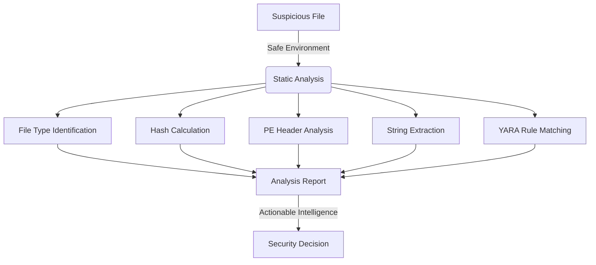

# Basic Malware Analysis Lab

   

A safe and educational tool for performing static analysis on potentially malicious files. This tool demonstrates malware analysis techniques in a controlled environment with comprehensive safety protocols.

## 🔒 Security Impact

This project demonstrates essential malware analysis principles:
- **Static Analysis**: Safe examination of suspicious files without execution
- **Threat Intelligence**: Systematic approach to understanding malware characteristics
- **Forensic Methodology**: Structured analysis process for incident response
- **Educational Security**: Teaching cybersecurity concepts through hands-on practice

### Analysis Workflow


## 🛡️ Cybersecurity Relevance

1. **Incident Response**: Provides structured approach to analyzing suspicious files
2. **Threat Hunting**: Enables proactive identification of malware characteristics
3. **Digital Forensics**: Supports forensic analysis workflows and evidence collection
4. **Security Education**: Teaches fundamental malware analysis concepts safely

## ⚠️ Safety Notice

This tool is for educational purposes only. Always:
- Use in a controlled, isolated environment
- Never analyze live malware without proper containment
- Use only known-safe sample files for testing
- Follow proper security protocols

## 🛠️ Features

- File type identification
- PE (Portable Executable) header analysis
- String extraction and analysis
- Basic YARA rule matching
- Hash calculation and comparison
- Basic entropy analysis
- Suspicious pattern detection

## 📋 Requirements

- Python 3.8+
- Dependencies listed in `requirements.txt`

## 🚀 Installation

1. Create a virtual environment:
```bash
python -m venv venv
source venv/bin/activate  # On Windows: venv\Scripts\activate
```

2. Install dependencies:
```bash
pip install -r requirements.txt
```

## 💻 Usage

To analyze a file, run the script from the project's root directory, providing the path to the sample file:
```bash
python src/analyzer.py path/to/your/sample_file
```
For example, to analyze a file from the `samples/` directory:
```bash
python src/analyzer.py samples/test_sample.txt
```

### Output
The script will print a detailed analysis report to your console, formatted using tables and panels. The report typically includes:
-   **File Information:** Size, MIME type, MD5, SHA1, and SHA256 hashes.
-   **PE Analysis (if applicable):** Machine type, compilation timestamp, and a table of PE sections with their names, virtual addresses, sizes, and entropy.
-   **YARA Scan Results:** A table of matched YARA rules and their descriptions (from `data/rules.yar`). If YARA is not available or rules don't load, it falls back to basic suspicious pattern matching.
-   **Extracted Strings:** The first 20 printable strings found in the file (minimum 4 characters).
-   **VirusTotal Check (Optional):** If a `VT_API_KEY` environment variable is set, the script will attempt to check the file's SHA256 hash against VirusTotal and display results if found.

Currently, the script does not support command-line options for output redirection; use standard shell redirection if you need to save the output to a file (e.g., `python src/analyzer.py path/to/sample > analysis_report.txt`).

## 📁 Project Structure

- `src/` - Source code
- `tests/` - Test files
- `samples/` - Sample files for testing (safe examples only)
- `data/` - Data files (YARA rules, etc.)

## Customizing YARA Rules
The analyzer uses YARA rules to identify patterns indicative of malware.
-   The primary YARA rule file used by the script is located at `data/rules.yar`.
-   To use your own custom YARA rules:
    1.  You can directly edit the existing `data/rules.yar` file.
    2.  Alternatively, you can replace `data/rules.yar` with your own `.yar` file (ensure it's named `rules.yar` and placed in the `data/` directory).
-   The script attempts to compile rules from this path upon startup. If the YARA Python package is not installed or `data/rules.yar` cannot be compiled, the script will fall back to a basic internal suspicious string pattern matching and print a warning.

## 🔒 Safety Features

- No execution of samples
- Read-only analysis
- Hash verification
- Safe string extraction
- Controlled environment checks

## ⚠️ Limitations
While this tool provides useful static analysis capabilities for educational purposes, it has several limitations:
-   **Static Analysis Only:** The tool does not perform dynamic analysis (i.e., it does not execute or sandbox the sample file). Behavioral analysis requires different tools and a more controlled environment.
-   **Basic PE Parsing:** PE header and section analysis is high-level and may not cover all advanced or malformed PE structures.
-   **String Extraction:** Relies on finding sequences of printable ASCII characters. Obfuscated, encoded, or non-ASCII Unicode strings might not be fully extracted or correctly interpreted.
-   **Entropy Calculation:** Entropy is a heuristic. While high entropy in PE sections can suggest packing or encryption, it's not definitive proof and requires further investigation.
-   **YARA Rule Dependency:** The effectiveness of YARA scanning is entirely dependent on the quality and comprehensiveness of the `data/rules.yar` file. The included `rules.yar` should be considered a basic example.
-   **VirusTotal API Key:** VirusTotal checks are only performed if a valid `VT_API_KEY` environment variable is set by the user.
-   **No Anti-VM/Anti-Debug Detection:** The static analysis performed does not check for common anti-virtualization or anti-debugging techniques malware might employ.

## 📚 Learning Resources

- [PE File Format](https://learn.microsoft.com/en-us/windows/win32/debug/pe-format)
- [YARA Documentation](https://yara.readthedocs.io/)
- [Malware Analysis Basics](https://www.malwarebytes.com/security-guide)
