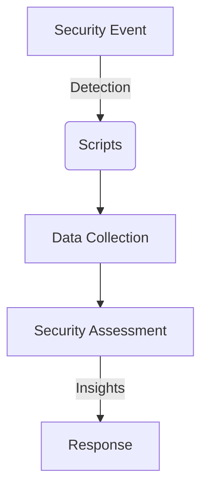

# PowerShell Automation Scripts for System Administration & Cybersecurity

   

A comprehensive collection of PowerShell scripts designed for Windows system administration, cybersecurity auditing, and incident response. Each script provides modular functionality with clear, actionable output for security professionals and system administrators.

## 🔒 Security Impact

This project demonstrates essential Windows security operations:
- **System Auditing**: Automated collection of security-relevant system information
- **Incident Response**: Rapid data gathering for forensic analysis and threat hunting
- **Compliance Monitoring**: Systematic checks for security configuration compliance
- **Threat Detection**: Proactive identification of suspicious processes and activities

### Security Operations Workflow


## 🛡️ Cybersecurity Relevance

1. **SOC Operations**: Streamlines security operations center workflows and investigations
2. **Incident Response**: Enables rapid data collection during security incidents
3. **Threat Hunting**: Supports proactive threat detection and analysis activities
4. **Compliance Auditing**: Facilitates security compliance checks and reporting

## Overview

The scripts in this collection automate common security checks, gather essential system information, and help identify potential security issues. They are designed for system administrators, SOC analysts, cybersecurity students, and security professionals leveraging PowerShell for Windows security operations.

## Prerequisites

*   **PowerShell Version:** PowerShell 5.1 or higher is recommended. Some scripts might use cmdlets more prevalent in newer versions.
*   **Execution Policy:** To run these scripts, your PowerShell execution policy must be set appropriately (e.g., `RemoteSigned` or `Bypass`). See the "Execution Policy" section under "Usage" for more details.
*   **Permissions:** Many scripts require Administrator privileges to access system-level information (e.g., event logs, WMI, certain registry keys, process details). Run PowerShell as an Administrator when using these scripts for full functionality.
*   **Windows Environment:** These scripts are primarily designed for Windows desktop and server operating systems.

## Available Scripts

All scripts are located in the `scripts/` subdirectory.

| Script Name                          | Description                                                                              |
| ------------------------------------ | ---------------------------------------------------------------------------------------- |
| `Get-SystemInfo.ps1`                 | Gathers comprehensive system hardware, OS, and configuration details.                    |
| `Get-LocalUserInfo.ps1`              | Retrieves detailed information about local user accounts, status, and group memberships. |
| `Monitor-CriticalServices.ps1`       | Checks and reports the running status of specified Windows services.                       |
| `Find-SuspiciousProcess.ps1`         | Identifies potentially suspicious processes based on path, metadata, or signature.       |
| `Get-RecentSystemErrors.ps1`         | Queries the System event log for Error and Warning events from recent hours.             |
| `Search-SpecificEventID.ps1`         | Searches a specified event log for one or more particular Event IDs.                     |
| `Check-LastPatchTime.ps1`            | Attempts to determine the last time Windows Updates were successfully installed.         |
| `Verify-AntivirusStatus.ps1`         | Checks the status of installed Antivirus software (Windows Defender and third-party via WMI). |
| `Audit-ScheduledTasks.ps1`           | Lists scheduled tasks with details on actions, triggers, and run-as users.             |
| `Get-FirewallRules.ps1`              | Retrieves Windows Firewall rules with optional filtering by state, direction, and action. |
| `Get-NetworkConnectionsSnapshot.ps1` | Captures current TCP connections and UDP listeners, optionally saving to CSV.            |
| `Collect-VolatileData.ps1`           | Gathers live volatile data like logged-on users, ARP cache, and DNS cache.             |
| `Get-LowDiskSpace.ps1`               | Checks local fixed disks for low free space below a specified threshold.                 |
| `Clear-TemporaryFiles.ps1`           | Identifies and optionally deletes files from common temporary locations (use with caution). |
| `Get-FirewallRulesSummary.ps1`       | Provides a high-level summary of firewall rules and highlights potentially risky configurations. |

> **Note:** For detailed information on parameters, examples, and full descriptions for any script listed above, please use the `Get-Help` cmdlet from within the `scripts/` directory. For example: `Get-Help .\Get-SystemInfo.ps1 -Full`

## Usage

1.  **Navigate to the Scripts Directory:**
    Open a PowerShell prompt and change to the `scripts` directory within this project:
    ```powershell
    cd path\to\cybersec-projects\powershell-automation\scripts
    ```

2.  **Running a Script:**
    Execute scripts using the `.\ScriptName.ps1` format. Many scripts accept parameters.
    ```powershell
    # Example:
    .\Get-LocalUserInfo.ps1
    .\Monitor-CriticalServices.ps1 -ServiceNames "WinRM", "Spooler"
    .\Search-SpecificEventID.ps1 -EventID 4625 -Hours 72
    ```

3.  **Getting Help for a Script:**
    All scripts include comment-based help. To view detailed help for any script, including its parameters and examples:
    ```powershell
    Get-Help .\ScriptName.ps1 -Full
    ```
    For example:
    ```powershell
    Get-Help .\Find-SuspiciousProcess.ps1 -Full
    ```

4.  **Execution Policy:**
    If you encounter an error like "running scripts is disabled on this system," you need to adjust your PowerShell execution policy. For a development machine, `RemoteSigned` is often a good choice.
    *   Open PowerShell **as an Administrator**.
    *   Run: `Set-ExecutionPolicy RemoteSigned -Scope CurrentUser -Force`
    *   Alternatively, for a single session or script run, you can bypass the policy:
        `powershell.exe -ExecutionPolicy Bypass -File .\ScriptName.ps1`

## Output

Scripts are designed to provide "super clean" output, primarily by:
*   Outputting PowerShell objects, allowing for further filtering, sorting, or exporting (e.g., `| Export-Csv -Path .\output.csv`).
*   Using `Format-Table` or `Format-List` for readable console display.
*   Using colored `Write-Host` messages for status, warnings, or errors, distinct from data output.

## Contributing

Contributions are welcome! If you have improvements, bug fixes, or new script ideas that align with the project's goals, please feel free to:

1.  Fork the repository.
2.  Create a new branch for your feature or fix (`git checkout -b feature/YourFeature` or `bugfix/YourBugFix`).
3.  Make your changes and commit them with clear messages.
4.  Ensure your scripts include comment-based help.
5.  Push your branch to your fork (`git push origin feature/YourFeature`).
6.  Open a Pull Request against the main repository.

Please ensure any contributed scripts adhere to a similar style and quality, focusing on clear output and robust error handling.
