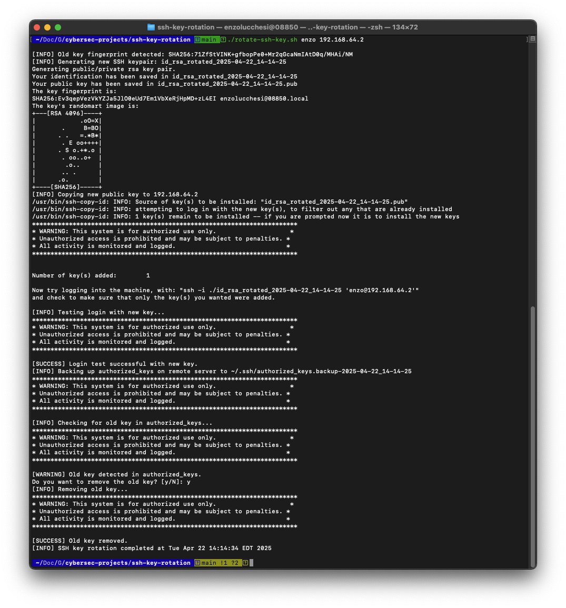

# SSH Key Rotation Script

## Overview
This project provides a script to safely rotate SSH keypairs for remote Linux servers. The script automates key generation, safely adds the new public key, verifies login before removal, and backs up the remote `authorized_keys` file. It also detects the fingerprint of the existing key and prompts before removing the old key to prevent accidental lockouts.

## Why Rotate SSH Keys?
- Reduce the risk of compromised or stale keys.
- Follow best practices for credential hygiene.
- Demonstrate real-world security automation.

## How It Works
1. Automatically detects the fingerprint of your current local `id_rsa.pub`.
2. Generates a new SSH keypair (`id_rsa_rotated_YYYY-MM-DD_HH-MM-SS`).
3. Adds the new public key to the remote server’s `authorized_keys`.
4. Verifies login using the new key to prevent lockout.
5. Backs up the current `authorized_keys` to `authorized_keys.backup-YYYYMMDD` on the remote server.
6. Matches the old key’s fingerprint against the entries in `authorized_keys`.
7. Prompts before removing the old key — only deletes if confirmed.

## Usage
```bash
chmod +x rotate-ssh-key.sh
./rotate-ssh-key.sh <remote_user> <remote_host>
```

Example:
```bash
./rotate-ssh-key.sh enzo 192.168.64.2
```

### Log Level Configuration
You can set the log level using the `SSH_KEY_ROTATION_LOG_LEVEL` environment variable:

```bash
# Available log levels: DEBUG, INFO, SUCCESS, WARNING, ERROR
SSH_KEY_ROTATION_LOG_LEVEL=DEBUG ./rotate-ssh-key.sh enzo 192.168.64.2
```

## Example Output (Log Excerpt)
```
2024-05-01 14:35:22 [INFO] Old key fingerprint detected: SHA256:abcdefgh1234567890examplefingerprint
2024-05-01 14:35:23 [INFO] Generating new SSH keypair in /home/user/.ssh/rotated-keys: id_rsa_rotated_2024-05-01_14-35-22
2024-05-01 14:35:24 [DEBUG] New key fingerprint: SHA256:newkeyfingerprint12345
2024-05-01 14:35:24 [DEBUG] New key permissions: -rw------- 1 user user 2602 May 1 14:35 /home/user/.ssh/rotated-keys/id_rsa_rotated_2024-05-01_14-35-22
2024-05-01 14:35:25 [INFO] Copying new public key to 192.168.64.2
2024-05-01 14:35:26 [INFO] Testing login with new key...
2024-05-01 14:35:26 [SUCCESS] Login test successful with new key
2024-05-01 14:35:27 [INFO] Backing up authorized_keys on remote server to ~/.ssh/authorized_keys.backup-2024-05-01_14-35-22
2024-05-01 14:35:27 [INFO] Checking for old key in authorized_keys...
2024-05-01 14:35:28 [WARNING] Old key detected in authorized_keys.
Do you want to remove the old key? [y/N]:
```

## 📸 Screenshots

### Successful SSH Key Rotation and Login Test



## Notes
- Tested on Ubuntu 22.04.
- Requires SSH access to the remote host with permissions to write to the `~/.ssh/authorized_keys` file for the specified remote user.
- The script currently handles a single remote host. Multi-host support could be added in future versions.
- Enhanced with structured logging with multiple log levels (DEBUG, INFO, SUCCESS, WARNING, ERROR).

## Log Levels
The script supports different log levels for better visibility and troubleshooting:

- **DEBUG**: Detailed information for troubleshooting (key fingerprints, permissions)
- **INFO**: Standard operation information
- **SUCCESS**: Operation completed successfully
- **WARNING**: Potential issues that don't stop execution
- **ERROR**: Critical issues that halt execution

## Future Improvements (Planned)
- Multi-server rotation via a `targets.txt` file
- Dry-run option to preview changes without applying them
- Automatic rollback if login verification fails
- Support for Ed25519 and other modern key types
- Key passphrase support with secure handling
- Configurable key paths and naming conventions
